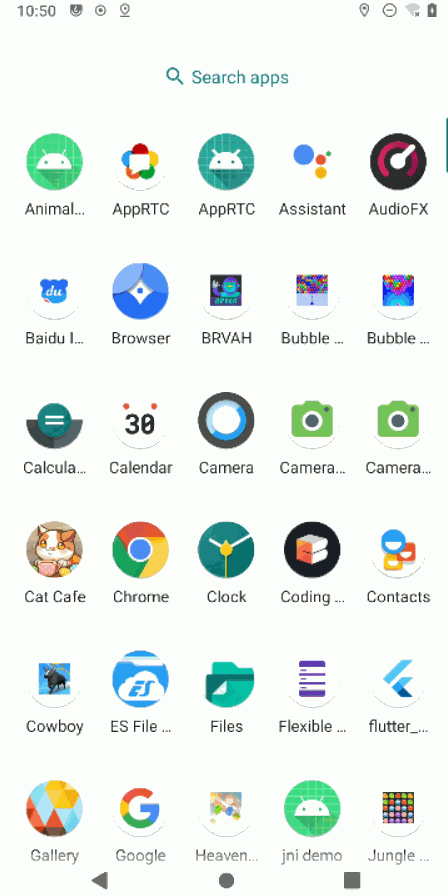

# Animal Crossing Tools - Android

## description

This is a tool helper player mark collected item in game and listening muisc, application 's some code can be reuseable in other project like network interactive, I'm separating it to shared module.

Project is using paging3, retrofit, hilt, okhttp, protobuf, navigation, Also this can help other people to know how to using morden android development skill.

## Intertive Preview

## requirement

flutter - newest dev version

## setup

`cd acnh_module && flutter pub get && cd ..`

`./gradlew assembleDebug`